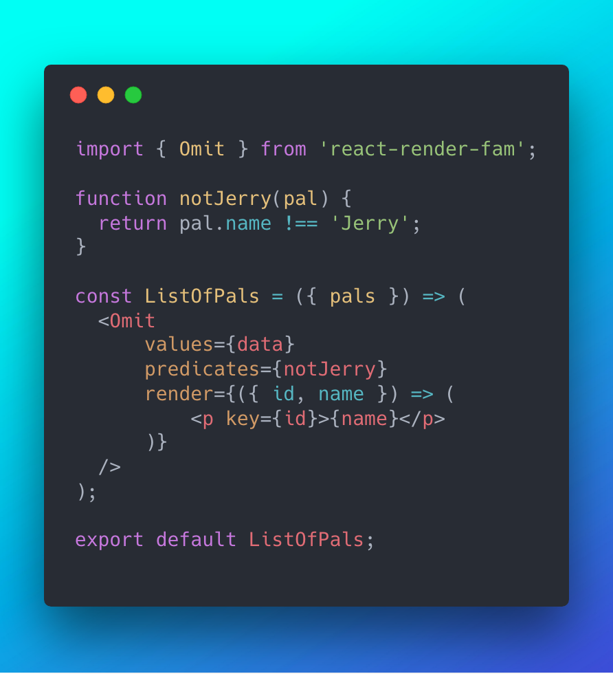

# react-render-fam

[](CONTRIBUTING.md#pull-requests)

A family of 🔥 components to make conditional rendering in React kool again.



## Installation

**npm:** `$ npm install --save react-render-fam`

_or_

**Yarn:** `$ yarn add react-render-fam`

## Usage

### `<If> `

Conditionally renders the children nodes when the predicate(s) return `true`.

**Props:**

- `predicate` A boolean expression

**Example:**

```jsx
import { If } from 'react-render-fam';

function shouldISayHello() {
    return true;
}

<If predicate={shouldISayHello()}>
    <p>Hello World!</p>
</If>
```

### `<Omit>`

Renders a subset of elements which return truthy for all supplied predicates.

**Props:**

- `predicates` A function **or** an array of functions. Current value is passed to each predicate for evaluation
- `values` An array of elements to be evaluated and rendered
- `render` Called for every value that satisfies the supplied predicates

**Example:** Renders all values between 6 and 99

```jsx
import { Omit } from 'react-render-fam';

const data = [
    { id: 2, value: 1 },
    { id: 3, value: 10 },
    { id: 4, value: 20 },
    { id: 5, value: 99 },
    { id: 7, value: 2000 },
];

const greaterThanFive = ({ value }) => value > 5;
const lessThanOneHundred = ({ value }) => value < 100;

<Omit
    values={data}
    predicates={[
        greaterThanFive,
        lessThanOneHundred,
    ]}
    render={({ id, value }) => (
        <p key={id}>{value}</p>
    )}
/>

```

### `<Sort>`

Sorts the elements in the order specified by the supplied comparison function. Internally uses [Array.prototype.sort()](https://developer.mozilla.org/en-US/docs/Web/JavaScript/Reference/Global_Objects/Array/sort) to determine the correct order of elements.

Defaults to ascending order if `compare` or `descending` props are omitted.

**Props:**

- `by` The key which is evaluated when comparing values
- `compare` A user supplied comparison function. For more information on using `compare` please see: [Array.prototype.sort()](https://developer.mozilla.org/en-US/docs/Web/JavaScript/Reference/Global_Objects/Array/sort)
- `descending` When supplied orders the elements in defending order (Assuming the comparison value is an `integer` or `string`)
- `values` An array of objects to be compared and rendered
- `render` A function used to render each sorted element  

**Example:** Renders the list of names in alphabetical order

```jsx
import { Sort } from 'react-render-fam';

const data = [
    { name: 'Edward', id: 1 },
    { name: 'Sharpe', id: 2 },
    { name: 'And', id: 3 },
    { name: 'The', id: 4 },
    { name: 'Magnetic', id: 5 },
    { name: 'Zeros', id: 6 },
];

const compare = (by, a, b) => {
    const nameA = a[by].toUpperCase();
    const nameB = b[by].toUpperCase();

    if (nameA < nameB) {
        return -1;
    }

    if (nameA > nameB) {
        return 1;
    }

    return 0;
};

<Sort
    values={data}
    by="name"
    compare={compare}
    render={({ id, name }) => (
        <p key={id}>{name}</p>
    )}
/>

```

## License

MIT © [Daniel Del Core](https://github.com/danieldelcore)
